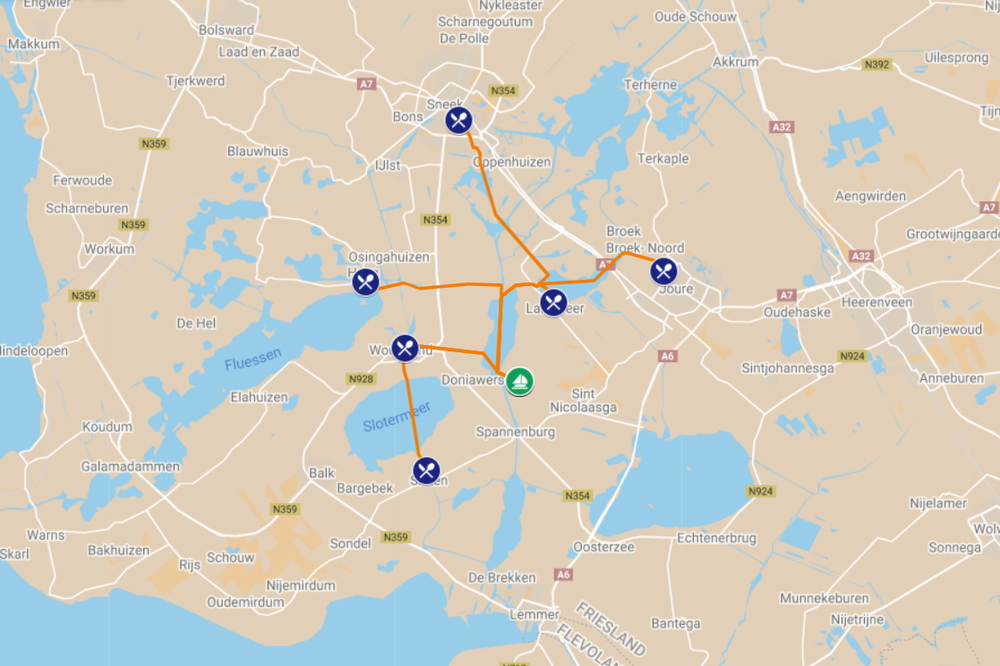

# Destination picker

This app calculates the best destination for your day trip, sailing from Idskenhuizen. Based on the (input) wind forecast, the sail time to each destination is estimated. Then whichever route time is closest to 6:30h sail time is considered the best destination for the day.
The routes to pick from are shown in the image below. Destinations are: Woudsend, Langweer, Sloten, Heeg, Joure and Sneek. 

At the moment only the effects from wind direction vs heading, wind strength and distance are implemented.
- The angle between the input wind direction and heading per section produce a base speed.
- The input wind strength produces a correction factor for the estimated time.

the app is available here: https://destinationpicker.ihpapp.com/

## Install dependencies

Option 1: Open the project in the remote container, containing the necessary Haskell tools: GHC, Cabal, Stack and the Haskell language server extension. Container OS: Debian.
Option 2: Install the haskell tools manually.

### Nix package manager
Install nix, following the instructions here: https://ihp.digitallyinduced.com/Guide/installation.html.

### IHP and dependencies
running the app for the first time will install the rest of the dependencies. This will take around 15m and may or may not work.
running nix-build, and the tests in nix-shell does work.
Alternatively start with a new IHP project and copy in the files. 

## Run

### Running unit tests
To run the domain unit tests, from the root folder, run:
- `runghc Test/TestController.hs`
- `runghc Test/TestCalculation.hs`

### Running the application
To run the application, run `./start` from the root folder. 
By default the app will be available on port 8000, IHP IDE on port 8001.

### Pipeline
On each commit the CI pipeline builds the application and runs the unit tests. If either fails, merge commits will be blocked.